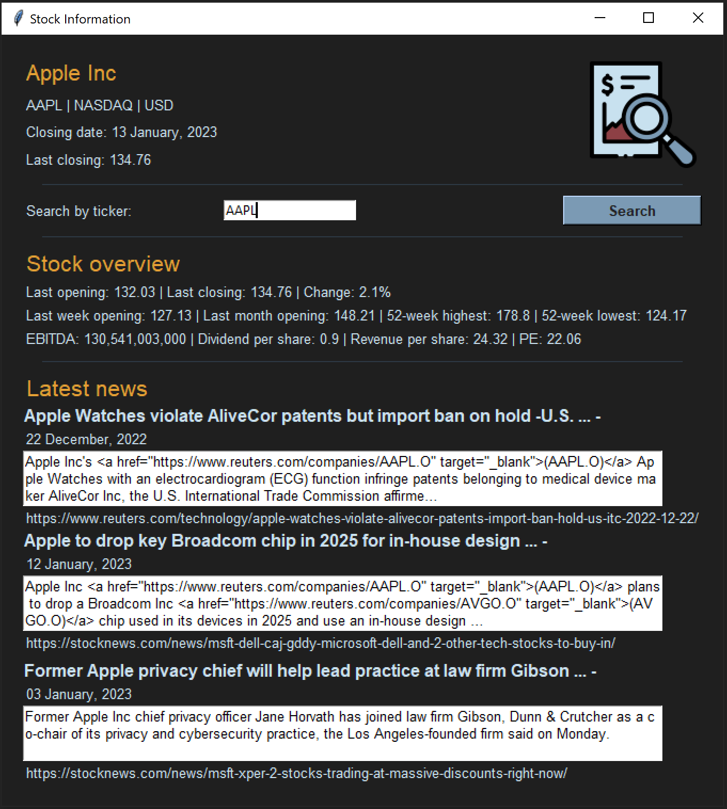

# stock_trading_news
Python stock information and news app

The user is able to see information pertaining to a company's stocks and main financials by searching using the stock's ticker.
The information is pulled using a free API from Alpha Vantage. News associated with that company is fetched using the free News API.
The app was created using python, and the GUI using Tkinter.

## Resources:
Logo: from https://www.flaticon.com/free-icons/stock-market title="stock market icons", Stock market icons created by Freepik - Flaticon

APIS:
From https://www.alphavantage.co/ Company Overview and Daily Adjusted
From https://newsapi.org/ All articles

Packages:
tkinter, requests, json, datetime, 